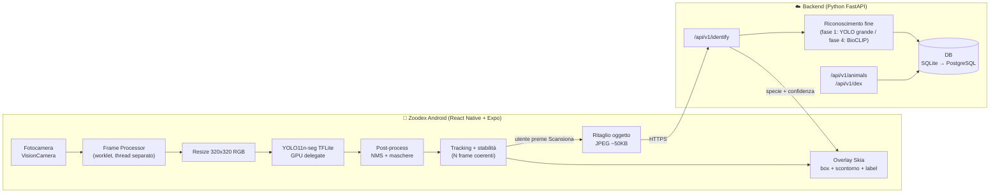

# Zoodex — Piano di implementazione

> Pokédex degli animali reali: inquadra un animale con la fotocamera, riconoscilo e sbloccalo nell'elenco del suo continente.
>
> **Stato documento:** v0.2 — approvato, Fase 0 in corso
> **Piattaforma iniziale:** Android (APK installato manualmente) · iOS in una fase successiva
> **Dispositivo di test:** Google Pixel 8a (Tensor G3, 8 GB RAM, Android 14+)
> **Expo project ID:** `bc5a1eb1-c292-4c7c-8e30-e62961bd000a`

---

## 0. Nome dell'app

Nome definitivo: **Zoodex** (slug Expo: `zoodex`, package Android: `com.zoodex.app`)

> ⚠️ Evitare "Poké-" / "Pokédex" nel nome e asset originali Pokémon (marchi registrati Nintendo/The Pokémon Company). Lo *stile* (rosso/bianco/blu, dispositivo con lente e LED) è libero, i loghi/sprite no.

---

## 1. Architettura generale

### 1.1 Chiarimento: dove gira il backend?

**Il backend NON gira sul telefono.** Gira su un server:

| Fase | Dove gira il backend |
|---|---|
| Sviluppo | Sul tuo PC Windows; il telefono lo raggiunge via Wi-Fi (stessa rete) |
| Test fuori casa | PC + tunnel (Cloudflare Tunnel / ngrok) |
| Produzione | Server cloud gratuito: **Hugging Face Spaces** (vedi §6.4) |

Il telefono fa **solo il lavoro leggero e real-time**; il lavoro pesante (riconoscimento della specie) avviene sul server, **solo quando l'utente preme "Scansiona"**. Questo è anche il modo migliore per risparmiare batteria.

### 1.2 Schema



### 1.3 Struttura della repository

```
Zoodex/
├── docs/                    # Documentazione (questo file, design system, decisioni)
├── mobile/                  # App React Native (Expo, TypeScript)
│   ├── app/                 # Schermate (expo-router)
│   ├── src/
│   │   ├── camera/          # Frame processor, pipeline detection
│   │   ├── ml/              # Decodifica output YOLO, NMS, maschere, tracker
│   │   ├── components/      # UI in stile Pokédex
│   │   ├── theme/           # Colori, font, spaziature
│   │   ├── api/             # Client verso backend
│   │   └── store/           # Stato globale (Zustand)
│   └── assets/models/       # yolo11n-seg_float16.tflite + labels
├── backend/                 # FastAPI
│   ├── app/
│   │   ├── api/             # Router (identify, animals, dex, health)
│   │   ├── services/        # Logica di riconoscimento
│   │   ├── models/          # Modelli DB (SQLModel)
│   │   └── core/            # Config, logging
│   ├── tests/
│   └── requirements.txt
└── ml/                      # Script Python: export/quantizzazione modelli, benchmark
```

---

## 2. Stack tecnologico

### 2.1 Mobile

| Ambito | Libreria | Motivo |
|---|---|---|
| Framework | **Expo (SDK stabile più recente) + React Native, TypeScript** | Un codice per Android e iOS, build cloud con EAS |
| Navigazione | `expo-router` | Routing a file, semplice |
| Fotocamera | `react-native-vision-camera` (v4) | Frame processor nativi ad alte prestazioni |
| Worklet | `react-native-worklets-core` | Esecuzione del codice di analisi fuori dal thread UI |
| Resize frame | `vision-camera-resize-plugin` | Ridimensiona e converte in RGB in nativo (veloce) |
| Inferenza | `react-native-fast-tflite` | TFLite con delegate GPU (Android) / CoreML (iOS) |
| Disegno overlay | `@shopify/react-native-skia` | Disegno di maschere e box a 60 fps |
| Stato | `zustand` | Leggero |
| Chiamate API | `@tanstack/react-query` | Cache, retry, stato di caricamento |
| Animazioni | `react-native-reanimated` | Micro-animazioni UI (lente, LED, scansione) |

> ℹ️ VisionCamera e fast-tflite contengono codice nativo → **non funzionano in Expo Go**. Si usa una **development build** (un APK "di sviluppo" installato una volta, poi il codice JS si ricarica in live via Wi-Fi).

### 2.2 Backend

| Ambito | Scelta |
|---|---|
| Linguaggio | Python 3.12 |
| Framework | FastAPI + Uvicorn |
| ORM / DB | SQLModel · SQLite in sviluppo → PostgreSQL in produzione |
| ML server | Ultralytics (fase 1–2), `open_clip` + BioCLIP (fase 4) |
| Validazione | Pydantic v2 |
| Test | pytest + httpx |
| Deploy (futuro) | Docker |

### 2.3 Modello on-device

- **YOLO11n-seg** (Ultralytics), pre-addestrato su COCO (80 classi: persone, oggetti, 10 animali).
- Export: `yolo export model=yolo11n-seg.pt format=tflite imgsz=320 half=True`
- Input **320×320** (compromesso velocità/precisione; si può salire a 416/640 se il telefono lo regge).
- Output TFLite seg:
  - `output0`: `[1, 116, 2100]` → 4 box + 80 classi + 32 coefficienti maschera per ognuna delle 2100 ancore
  - `output1`: `[1, 80, 80, 32]` → prototipi delle maschere
- Maschera finale = `sigmoid(coeff · prototipi)`, ritagliata al box e scalata alla preview.

> ⚠️ **Licenza:** Ultralytics YOLO è AGPL-3.0. Va benissimo per prototipo/uso personale. Prima di una pubblicazione commerciale: licenza Ultralytics Enterprise oppure migrazione a modello Apache-2.0 (RTMDet-Ins, YOLOX + segmentatore). L'architettura del codice (`src/ml/`) sarà isolata per rendere lo swap semplice.

---

## 3. Strategia di risparmio batteria 🔋

Il consumo principale viene da: **sensore fotocamera + inferenza NN + schermo + radio**. Misure previste:

| # | Tecnica | Impatto |
|---|---|---|
| 1 | **Fotocamera attiva solo nella schermata Scanner** e solo se l'app è in primo piano (`isActive` legato a focus schermata + `AppState`) | Alto |
| 2 | **Formato camera ridotto** (preview ~720p, non 4K) e fps camera limitati a 30 | Alto |
| 3 | **Inferenza su input 320×320** e modello *nano* quantizzato FP16 (INT8 in seguito) | Alto |
| 4 | **Throttling adattivo**: inferenza a ~10–15 fps invece di 30; scende a ~3–5 fps se la scena è statica o nessun oggetto è rilevato da X secondi | Alto |
| 5 | **Delegate GPU** (Android) invece della CPU: più veloce e più efficiente per watt | Medio-alto |
| 6 | **Maschere calcolate solo per gli oggetti mostrati** (top-K, es. max 5) e solo per l'oggetto selezionato in modalità "risparmio" | Medio |
| 7 | **Rete solo su azione esplicita** ("Scansiona"): invio di un ritaglio JPEG compresso (~50 KB), mai stream video | Alto |
| 8 | **Cache dei risultati** (stessa specie già identificata → niente nuova richiesta) | Basso-medio |
| 9 | **Modalità risparmio** attivabile (fps inferenza ridotti, no maschere, solo box) e attivata automaticamente con batteria < 20% (`expo-battery`) | Medio |
| 10 | **Timeout inattività**: dopo 60 s senza interazione lo scanner va in pausa ("lente spenta"), tap per riattivare | Alto |

**Come misuriamo:** overlay di debug in-app (fps camera, fps inferenza, ms per inferenza, temperatura stimata); test di 10 minuti di scansione continua misurando la % batteria consumata. Obiettivo indicativo: **≤ 6–8% di batteria per 10 min di scansione continua** su un telefono di fascia media.

---

## 4. Affidabilità del riconoscimento

1. **Soglia di confidenza** configurabile (default 0.45) + **NMS** con IoU 0.5.
2. **Tracker leggero** (IoU-matching tra frame, stile SORT semplificato) → ogni oggetto ha un ID stabile; evita il "tremolio" di etichette e box.
3. **Smoothing temporale**: box e label mediati sugli ultimi N frame (EMA).
4. **Regola di stabilità**: un oggetto è "agganciato" (lock-on, il mirino diventa rosso) solo se presente con la stessa classe per **≥ 8 frame consecutivi**.
5. **Conferma server** (fase 2+): lo sblocco nel Dex avviene solo se il backend conferma con confidenza ≥ soglia.
6. **Filtro geografico** (fase 4): le specie candidate vengono pesate in base al continente/posizione GPS.

---

## 5. Design system (stile Pokédex)

### 5.1 Palette

| Token | Hex | Uso |
|---|---|---|
| `dexRed` | `#DC0A2D` | Corpo principale, header, bottoni primari |
| `dexRedDark` | `#A00020` | Ombre, bordi, stati premuti |
| `dexWhite` | `#FFFFFF` | Schermi/card, testo su rosso |
| `dexScreen` | `#F2F5F7` | Sfondo "display" |
| `dexBlue` | `#3B4CCA` | Accenti, tab attiva, link |
| `dexLensBlue` | `#30A7D7` | Lente luminosa, glow, mirino |
| `dexYellow` | `#FFCB05` | LED, badge "nuovo", evidenziazioni |
| `dexGreen` | `#4DAD5B` | LED stato OK / sbloccato |
| `dexInk` | `#1B1B1F` | Testo principale, silhouette animali bloccati |

### 5.2 Tipografia
- Titoli: font pixel/retro (es. **"Press Start 2P"** o **"Silkscreen"**, Google Fonts) — usato con parsimonia.
- Testo: **"Nunito"** o **"Inter"** per leggibilità.

### 5.3 Componenti chiave
- **DexHeader**: barra rossa con grande lente blu luminosa (glow animato) + 3 LED (rosso, giallo, verde).
- **ScannerFrame**: cornice del dispositivo attorno alla preview camera, mirino animato, linea di scansione.
- **DetectionOverlay**: scontorni semitrasparenti colorati per classe + etichetta tipo "fumetto Pokédex".
- **LockOnIndicator**: mirino che si stringe e diventa rosso quando l'oggetto è stabile.
- **DexCard**: card animale con numero (#001), silhouette nera se bloccato, foto + scheda se sbloccato.
- **ContinentMap**: selezione continente come menu principale.

---

## 6. Workflow di sviluppo e build Android

### 6.1 Prerequisiti (da fare una volta)
- [x] Account gratuito **Expo** (https://expo.dev) → necessario per EAS Build
- [ ] `npm i -g eas-cli` e `eas login`
- [ ] Sul telefono Android: abilitare "Installa app da origini sconosciute"
- [ ] Python 3.12 (già presente via `py`) → venv in `backend/` e `ml/`
- [ ] (Opzionale) Android Studio, solo se in futuro vogliamo build locali senza cloud

> Stato attuale PC: Node 22 ✅ · Git ✅ · Python 3.12 (`py`) ✅ · Java/Android SDK ❌ → useremo **EAS Build in cloud**, quindi non servono.

### 6.2 Due tipi di APK

| Profilo EAS | Cosa produce | Quando usarlo |
|---|---|---|
| `development` | APK "dev client" che si connette al PC (Metro) → modifiche JS visibili in tempo reale | Durante lo sviluppo quotidiano. Si ricompila solo se cambiano le dipendenze native |
| `preview` | APK standalone (`buildType: apk`), funziona senza PC | Test reali, prove batteria, da passare ad altri |

Comandi:
```bash
eas build -p android --profile development   # APK di sviluppo
eas build -p android --profile preview       # APK standalone
npx expo start --dev-client                  # avvia Metro per il dev client
```
EAS restituisce un link/QR per scaricare l'APK direttamente sul telefono.

### 6.3 Collegamento telefono ↔ backend in sviluppo
- Backend avviato con `uvicorn app.main:app --host 0.0.0.0 --port 8000`
- L'app usa `EXPO_PUBLIC_API_URL=http://<IP-del-PC>:8000`
- Regola Firewall Windows per la porta 8000 (rete privata)
- Alternativa: `cloudflared tunnel` per HTTPS pubblico temporaneo

### 6.4 Deploy gratuito del backend

| Servizio | Free tier | Adatto a Zoodex? |
|---|---|---|
| **Hugging Face Spaces (Docker)** | 2 vCPU, **16 GB RAM**, HTTPS incluso; va in sleep dopo ~48h senza richieste (riparte da solo in ~30–60 s) | ✅ **Scelta consigliata**: pensato per modelli ML, RAM sufficiente per PyTorch/BioCLIP |
| Render (free web service) | 512 MB RAM, sleep dopo 15 min | ❌ RAM insufficiente per PyTorch |
| Koyeb (free) | 512 MB RAM | ❌ Come sopra |
| Google Cloud Run | 2M richieste/mese gratis, scala a zero | ⚠️ Ottimo ma richiede carta di credito |
| Oracle Cloud Always Free | 4 core ARM, 24 GB RAM, sempre acceso | ⚠️ Potente ma registrazione/configurazione complesse |

**Database** (fase 3): lo storage di HF Spaces free è *effimero* → il DB va fuori:
**Neon** o **Supabase** (PostgreSQL gratuito, ~0.5 GB, più che sufficiente per catalogo + sblocchi).

**Fallback senza server:** l'app funziona comunque in modalità solo on-device (YOLO sul telefono). Se il backend non risponde, la scansione viene messa in coda e inviata quando torna disponibile.

---

## 7. Fasi di sviluppo

### Fase 0 — Setup (½ giornata)
- [ ] Inizializzare `mobile/` con Expo (TypeScript, expo-router)
- [ ] Inizializzare `backend/` con FastAPI + endpoint `/health`
- [ ] Script `ml/export_yolo.py`: scarica `yolo11n-seg.pt`, esporta TFLite FP16 a 320, copia in `mobile/assets/models/`
- [ ] Configurare `eas.json` (profili development / preview)
- [ ] `.gitignore`, README, lint (ESLint + Prettier, Ruff per Python)

**Criterio di completamento:** APK di sviluppo installato sul telefono che mostra una schermata e chiama `/health` del backend.

### Fase 1 — Object detection + segmentazione on-device (cuore di questa fase) 🎯
- [ ] Schermata Scanner con VisionCamera, permessi camera, gestione `isActive`
- [ ] Frame processor: resize 320×320 RGB → inferenza TFLite (GPU delegate)
- [ ] Decodifica output YOLO-seg in worklet: box, classi, NMS
- [ ] Calcolo maschere (prototipi × coefficienti) per top-K oggetti
- [ ] Overlay Skia: scontorno colorato + box + etichetta + confidenza
- [ ] Tracker IoU + smoothing + regola lock-on
- [ ] Throttling adattivo e modalità risparmio
- [ ] Overlay debug (fps, ms inferenza)
- [ ] UI base in stile Pokédex attorno allo scanner

**Criterio di completamento:**
- Riconosce e scontorna in tempo reale gli oggetti COCO (persona, tazza, bottiglia, cane, gatto, ecc.)
- ≥ 10 fps di inferenza su telefono di fascia media, UI fluida a 60 fps
- Nessun crash dopo 10 minuti di uso continuo; consumo batteria misurato e documentato

### Fase 2 — Backend e scansione ibrida
- [ ] Endpoint `POST /api/v1/identify` (multipart: immagine ritagliata + label COCO + metadati)
- [ ] Servizio di riconoscimento v1: YOLO11 più grande (es. `yolo11m-seg`/`yolo11l`) lato server per verifica/precisione superiore
- [ ] Bottone "Scansiona" nell'app: ritaglia l'oggetto agganciato, comprime, invia
- [ ] Schermata risultato stile Pokédex ("Analisi in corso…" → scheda)
- [ ] Gestione errori/offline (coda di scansioni da inviare dopo)

### Fase 3 — Il Dex: continenti, catalogo e sblocchi
- [ ] Modello dati: `Continent`, `Animal` (nome comune/scientifico, continente/i, numero Dex, rarità, descrizione), `User`, `Unlock`
- [ ] Seed iniziale: ~20–30 animali per continente (dati da Wikipedia/GBIF/iNaturalist con licenze compatibili)
- [ ] Endpoint `GET /continents`, `GET /animals?continent=`, `GET/POST /dex`
- [ ] Nessun login: identità anonima tramite UUID generato al primo avvio e salvato sul dispositivo (account veri in futuro, eventualmente)
- [ ] Schermate: mappa continenti, griglia Dex con silhouette, dettaglio animale, animazione "Nuovo animale sbloccato!"

### Fase 4 — Riconoscimento delle specie
- [ ] Integrazione **BioCLIP** (zero-shot su lista specie del catalogo) lato server
- [ ] Filtro per continente/GPS (`expo-location`, solo con consenso)
- [ ] Valutazione precisione su un piccolo set di test (foto reali + foto zoo)
- [ ] (Opzionale) classificatore di specie leggero on-device per modalità offline

### Fase 5 — Rifinitura e iOS
- [ ] Build iOS con EAS (richiede account Apple Developer)
- [ ] Deploy backend su cloud + HTTPS
- [ ] Ottimizzazione INT8, test su più dispositivi
- [ ] Valutazione licenze (YOLO AGPL) prima di eventuale pubblicazione

---

## 8. Rischi e mitigazioni

| Rischio | Probabilità | Mitigazione |
|---|---|---|
| Export TFLite di YOLO-seg problematico su Windows (dipendenze TensorFlow) | Media | Fallback: export su Google Colab; versione modello fissata |
| Post-processing maschere troppo lento in JS worklet | Media | Limitare top-K, prototipi a bassa risoluzione, eventualmente plugin nativo Kotlin |
| GPU delegate non supportato su alcuni telefoni | Bassa | Fallback automatico su CPU (XNNPACK) |
| Surriscaldamento / consumo elevato | Media | Throttling adattivo, modalità risparmio, timeout inattività |
| COCO ha pochi animali | Certa | Atteso: risolto con il backend (fase 2/4) |
| Licenza AGPL | Certa per uso commerciale | Codice ML isolato, swap verso modello Apache |

---

## 9. Decisioni aperte

| Decisione | Esito |
|---|---|
| Nome app | ✅ **Zoodex** |
| Account Expo | ✅ Creato (project ID in testata) |
| Telefono di test | ✅ Pixel 8a → si parte con input 320, poi si prova 416/640 |
| Login | ✅ Nessun login (UUID anonimo) |
| Hosting backend | ✅ Hugging Face Spaces (free) + Neon/Supabase per il DB |
